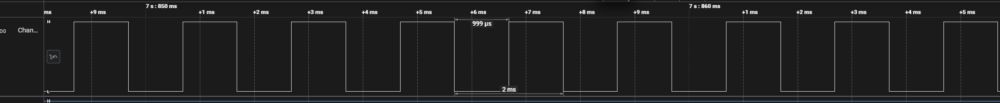

# 473freeRTOS
This repository contains the single task example, deferred interrupt example, and starter file for the robot task of Lab 3 of EECS 473.
EECS473 is an embedded systems class that uses the RPI4 running free RTOS to control a simple 2 wheel robot.
This is a starting example running one task every 1ms to toggle GPIO pin 21.
See the main.c, or toggle21.c in the parent directory.

The FreeRTOS port was developed by KeepBeyond at this [repository](https://github.com/keep-beyond/pi5_freertos).

If you want instructions on how to compile this example see the tutorial file [here](https://docs.google.com/document/d/10oXdHwRclKeVJgA8NU2OM0aE9q8v3xgw/edit?usp=sharing&ouid=106568666511841334504&rtpof=true&sd=true)

In addition, you will find a deferred interrupt example in the file deferred_interrupt_example. See the comments for more details and the following image for the generated waverform. Copy the file contents into the main.c and compile to try. 

